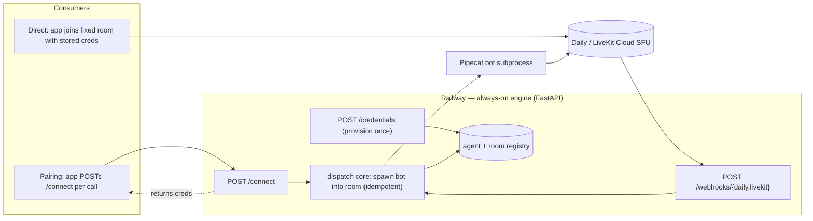

# Voice Agent Bot Engine — Implementation Plan

*A Python engine, deployed always-on to Railway, that hosts voice agents reachable over WebRTC through Daily and LiveKit. It exists to (1) test the iOS CallKit/WebRTC client against a real agent, and (2) serve as the reference implementation that anyone building their own agent copies.*

---

## 0. Context for the implementer

The product this serves is a "dumb pipe" iOS calling app: the **agent owns the brain** (model, voice, persona, memory), and the **app is a faithful audio channel** that places the agent session as a native phone call. This engine is the agent side. It is deliberately agent-*agnostic* infrastructure, not a model provider — keep that framing when making local decisions, because it dictates that model/voice choices stay swappable config, never hardcoded assumptions.

There are two consumers:

- **The iOS client** (primary) — connects over WebRTC via the Pipecat iOS SDK, speaking the RTVI protocol over either a Daily or a LiveKit transport.
- **A standalone test client** (web or CLI) — so the engine can be verified end-to-end *before and independently of* the iOS app. The simulator cannot exercise CallKit or publish the mic, so a laptop-side client is how the engine dev confirms a real two-way conversation works.

The single most important architectural property: **the bot pipeline is launch-agnostic.** It receives a room, a token, a transport selection, and an agent config, and runs. It does not know or care whether it was launched by a pairing call, a webhook, or a developer's script. Everything below preserves that.

---

## 1. Architecture overview

One Pipecat codebase. The transport (Daily | LiveKit) is selected per dispatch, and both run against the managed **cloud** SFUs (Daily Cloud, LiveKit Cloud) — **not** self-hosted media servers. This matters for Railway: the bot is an *outbound* client to the SFU and never terminates WebRTC itself, so the engine needs only an inbound HTTPS port (for the dispatcher and webhooks) and no inbound UDP, STUN, or TURN. (Inbound UDP/TURN is the SmallWebRTC story, deliberately out of scope — see §10.)

The engine is two things running together:

- **An always-on dispatcher** (FastAPI). It mints credentials, receives triggers, and dispatches bots. It must not sleep — disable Railway Serverless on this service, because it has to receive webhooks and respond to `/connect` promptly at any time.
- **On-demand bot subprocesses.** Each call spawns a Pipecat bot process that joins exactly one room, runs its pipeline, and exits when the room empties. No bot is ever resident in an idle room.

Two credential modes share one dispatch core:



- **Pairing mode** (the eventual product default; ntfy-shaped): app POSTs to `/connect` per call. The engine creates a room, mints a short-TTL token, dispatches the bot into it, and returns the credentials. The bot is in the room before (or moments after) the app joins.
- **Direct mode** (the fallback, and what the iOS MVP uses first): the dev or app-setup calls `/credentials` **once** to get a stable room + long-lived token, pasted into the app's add/edit sheet. At call time the app joins that fixed room directly; the SFU fires a participant-joined **webhook**; the engine dispatches the bot reactively. No endpoint call at call time, and no resident bot.

Both triggers converge on the same dispatch core and the same launch-agnostic bot entrypoint.

---

## 2. Components

### 2.1 The dispatcher (FastAPI, always-on)

Endpoints:

- `POST /connect` — **pairing**. Body: `{ "agent_id": "...", "transport": "daily" | "livekit" }`. Creates a room, mints a short-TTL participant token for the app, spawns the bot into the room, returns the connection payload (§4). Short TTL is fine here because credentials are born per call.
- `POST /credentials` — **direct provision**. Body: `{ "agent_id": "...", "transport": "daily" | "livekit" }`. Ensures a stable room exists, mints a long-lived participant token, records the room in the registry as agent-enabled (mapped to `agent_id`), and returns the same connection payload shape. Called once; the result is pasted into the app.
- `POST /webhooks/daily`, `POST /webhooks/livekit` — receive transport events. On a participant-joined event for a registered direct-mode room that has no active bot, dispatch a bot. **Must verify the webhook signature** and **must be idempotent** (track active bots per room; never spawn a second).
- `GET /health` — liveness for Railway and for keep-warm.
- `POST /admin/disconnect` *(optional but recommended)* — force-disconnect a bot from a room. This is the clean way to simulate a mid-call drop so the client's reconnection-with-spoken-state can be tested deterministically without airplane-mode fiddling.

**Auth.** `/connect`, `/credentials`, and `/admin/*` mint credentials and spawn billable bots, so they must require a caller credential — a shared bearer token (`ENGINE_API_KEY`) checked on every request. An unauthenticated dispatcher sitting on a public, always-on URL is a direct cost-and-abuse vector: anyone who finds it can spawn bots and burn your transport and model spend. Webhooks are the exception — they authenticate by signature verification, because the caller is the SFU, not a user.

Internal state:

- **Agent registry**: `agent_id → { pipeline_factory, default_transport, model_config }`. Ship two agents: `loopback` and `live`. This registry is also the seam for future curated default agents — adding one is registering a new factory, nothing more.
- **Room registry**: which rooms are agent-enabled (direct mode), their `agent_id`, and active-bot tracking for idempotent dispatch.
- Start the registries behind a small interface backed by a lightweight store (Railway Postgres or Redis). An in-process dict is acceptable only for the very first milestone (loopback + pairing), since pairing creates everything it needs within a single request. **The room registry must be persistent before direct mode is reliable**, though: direct-mode rooms are recorded at provision time and read back when a webhook fires — possibly days later, and across redeploys. If that mapping lives only in memory, a redeploy silently orphans every provisioned room: the webhook arrives, the engine doesn't recognize the room, no bot is dispatched, and the call connects to nobody. Specify the interface up front so the persistent swap is not a refactor.
- **Token minting**: server-side only, using the Daily/LiveKit API secrets. Short TTL for pairing, long TTL for direct. The bot's own token is also minted server-side per dispatch.

### 2.2 The bot (Pipecat pipeline)

Launch-agnostic entrypoint along the lines of `bot(runner_args)` (Pipecat ≥ 1.0 convention): it receives room URL, token, transport type, and agent config, builds the transport, builds the pipeline for the requested `agent_id`, and runs.

- **Transport adapter**: `DailyTransport` or `LiveKitTransport`, selected by config. The pipeline is otherwise identical across transports — this is what proves the client's "swap the transport" claim and lets any cross-transport behavioral difference be attributed to the transport/client seam rather than to bot logic.
- **Pipelines**:
  - **`loopback`** — `transport.input() → transport.output()` audio passthrough, **no model, no keys, no external dependencies, zero added latency**. This isolates the audio path: CallKit↔WebRTC activation, route switching, mute, the speaker-not-earpiece default, and raw quality. If something is wrong here, it is the pipe, not the agent.
  - **`live`** — à la carte `input → STT → context → LLM → TTS → output`, with RTVI processors/observer in the pipeline. This is the documentation centerpiece and the realistic end-to-end test. It should **greet on connect** (trigger an initial spoken line off RTVI `on_client_ready`), so there is immediate downlink audio to confirm the moment the session activates — useful for the Layer 1 connect-and-downlink check and a natural way to open a call. Barge-in/interruption is on by default with VAD; keep it on, since the client's always-listening model depends on it.
- **RTVI** (enabled by default in Pipecat): emit clean **speaking-state events in both directions** plus transcripts. The client's listening/speaking glow is driven entirely by these — so this is a *contract*, not a nicety: a custom agent that omits RTVI speaking state will leave the glow dark. Demonstrate it correctly in the `live` bot, and document it as a requirement for third-party agents. For `loopback`, optionally emit a synthetic bot-speaking signal while it is echoing, so the glow can be exercised without standing up the full pipeline (recommended; small effort).
- **Turn detection / VAD**: Silero VAD. **Expose the endpointing delay as a documented config knob.** The thinking-partner use case needs to tolerate silence rather than snap-respond; this knob is where that lives, and surfacing it teaches the single most important thing a conversational-agent builder needs to tune.

### 2.3 Default model stack for the `live` bot

À la carte, per the chosen direction, because it shows the full pipeline and where to swap each piece. Treat the specific providers as **reference defaults the implementer substitutes for whatever keys are in hand** — the point of the engine is that this is swappable.

- STT: a streaming provider (e.g., Deepgram).
- LLM: a fast model (Claude is the natural default given the surrounding ecosystem; any works).
- TTS: a low-latency provider (e.g., Cartesia).

Each is a Pipecat service plugin and transport-independent, so the stack is identical for the Daily and LiveKit bots. Document the one-line swap for each stage.

### 2.4 Standalone test client

Use Pipecat's prebuilt web client (or a minimal CLI built on a Pipecat client SDK) to join a room and talk to the bot from a laptop. This is the dev's verification harness before the iOS app exists, and it doubles as a quick smoke test of any engine change.

### 2.5 Bot lifecycle, teardown, and reconnection

This is the one place Pipecat's defaults work *against* the client, so it needs deliberate handling. The common Pipecat pattern cancels the pipeline task the instant the human participant leaves (`on_participant_left → task.cancel()`). That is wrong here: the iOS client's defining problem is dropped media in tunnels and dead zones, where it disconnects and reconnects with backoff while CallKit still treats the call as up. If the bot exits the moment the human's connection drops, the client reconnects into an empty room and the conversation is dead — silently breaking the headline reconnection feature. A developer following the standard Pipecat example will hit this by default.

Teardown policy:

- On human-participant-left, **do not exit immediately.** Start a "human-absent" grace timer and tear down only if the human hasn't rejoined when it expires. While the bot stays, the room is non-empty so it won't auto-close, and a rejoining client finds the same bot and resumes mid-conversation.
- A real hangup and a dropped connection look identical to the bot at the transport layer. Disambiguate with an **explicit end signal** from the client on intentional hangup (an RTVI/data-channel "end" message, or the app hitting `/admin/disconnect` for its own session) so the bot exits at once on real ends and reserves the grace window for genuine drops. Specify which signal the client sends; without it, every hangup harmlessly waits out the full window.
- The grace window is a **shared constant with the client team**: it must be ≥ the client's total reconnection-with-backoff budget, and no longer than necessary (the bot is a billed participant during the window — long enough to survive a tunnel, not minutes of dead air).
- The app's **test-connection** action (a quick connect-then-disconnect) will, in direct mode, fire the join webhook and spawn a real bot before disconnecting. That's expected — idempotent dispatch plus the grace window absorb it — but the engine dev should know a test-connection is a real (brief, billable) bot spawn, not a no-op probe.

---

## 3. Credential modes — detailed flows

**Pairing (`/connect`)**

1. App POSTs `{ agent_id, transport }`.
2. Engine creates a room, mints a short-TTL app token and a bot token.
3. Engine dispatches the bot subprocess into the room.
4. Engine returns the connection payload to the app.
5. App joins; bot is already present. Conversation proceeds. On a real hangup the bot exits and the room auto-closes; on a dropped connection it waits out the grace window for the client to reconnect (see §2.5).

**Direct (`/credentials` + webhook)**

1. *Provision (once):* dev/app-setup POSTs `{ agent_id, transport }`. Engine ensures a stable room, mints a long-lived app token, records the room as agent-enabled, returns the payload. Dev pastes it into the app.
2. *Call time (later):* app joins the fixed room with the stored token. SFU fires a participant-joined webhook to the engine. Engine checks the registry, confirms the room is agent-enabled and has no active bot, and dispatches the bot. Conversation proceeds; teardown per §2.5.

Note a latency asymmetry between the modes. In pairing the bot is dispatched *before* the app joins, so it's arriving as the app connects. In direct the human joins *first*, then waits out the webhook round-trip plus bot spawn plus bot join. That gap is real — a few seconds, more on the first spawn after a deploy (see §5) — and is exactly what the client's "Connecting…" spoken state is there to cover.

Why direct mode needs the webhook: the credentials are minted long before the call, so the bot cannot be dispatched at provision time, and a resident bot would bill connection-minutes continuously for a service used minutes a day. The webhook makes dispatch happen exactly at call time, with no idle cost.

**Rejected alternative (decided against):** a bot resident in each direct-mode room. Simpler to wire, but it bills participant/connection-minutes around the clock — a meter running on dead air for a service used minutes a day — and it's operationally fragile: nothing re-adds the bot if it crashes or is killed on redeploy, so the room goes silently bot-less until the next deploy. Webhook dispatch is the chosen design.

**Future optimization (not now):** LiveKit's native dispatch can encode "dispatch agent X on connect" directly in the participant token, removing the webhook hop for the LiveKit transport. It lives in the `livekit-agents` framework and so belongs with the deferred native-LiveKit reference (§10); webhook dispatch keeps both transports uniform under Pipecat today.

---

## 4. The connection contract (forward-compatible, internal — not a frozen public spec)

Both modes return the same JSON shape; they differ only in token lifetime and who calls. Define it now so the app and engine agree, but **do not publish it as the third-party spec yet** — freezing a public contract before the app even consumes a pairing endpoint is a one-way door. Keep it internal and forward-compatible.

```jsonc
{
  "transport": "daily" | "livekit",
  "connection": {
    // daily:   { "room_url": "...", "token": "..." }
    // livekit: { "url": "wss://...", "token": "..." }
  },
  "agent_id": "loopback" | "live",
  "expires_at": "<ISO8601 | null>"   // null/long for direct, short for pairing
}
```

Token lifetime note for the client team: a token's expiry gates only the **initial** connection, not reconnects — so a long-lived direct token will not sabotage the client's reconnection-with-backoff behavior, and even a token that lapses mid-drive won't break recovery.

---

## 5. Railway deployment

- **Always-on dispatcher.** Disable Serverless/app-sleeping on this service — it must receive webhooks and serve `/connect` without a cold start. (Keep a `/health` ping as a backstop.)
- **Process model.** Web process = the FastAPI dispatcher. Bots = subprocesses spawned per call (Pipecat's subprocess pattern). At test scale concurrency is ~1; for the docs audience, note the ~5–10 concurrent-bots-per-host ceiling driven by VAD CPU, and the container PID-limit gotcha that bites heavily-forking deployments (not this one).
- **Why Railway is sufficient.** The bot dials *out* to the cloud SFU; the only inbound surface is the HTTPS dispatcher + webhook ingress. No inbound UDP, no media termination, no TURN.
- **Secrets / env vars** (all accounts already in hand):
  - `DAILY_API_KEY`
  - `LIVEKIT_API_KEY`, `LIVEKIT_API_SECRET`, `LIVEKIT_URL`
  - STT/LLM/TTS provider keys for the `live` bot (per chosen stack)
  - Webhook signing secrets for Daily and LiveKit
  - `PUBLIC_BASE_URL` (for webhook registration)
  - `ENGINE_API_KEY` (bearer token for `/connect`, `/credentials`, `/admin/*`)
- **Spawn latency / warm-up.** A fresh bot subprocess loads its VAD model and opens connections to the STT/LLM/TTS providers before first audio; the *first* spawn after a deploy also downloads and caches the Silero model and is the slowest. At test scale this is acceptable — the client announces "Connecting…" — but expect a few seconds to first bot audio, and pre-warm the model in the image (or keep a warm subprocess) if it ever feels too slow. Redeploying kills in-flight bot subprocesses and drops any active call, so deploy when quiet.
- **Cost posture.** Connection/participant-minutes accrue only while a bot or app is actually connected — i.e., only during calls. The idle dispatcher costs compute, not minutes. No resident bots anywhere.

---

## 6. How the bots serve the client's test layers

The iOS client is tested in three layers; the engine's job is to make each layer exercisable.

- **Layer 1 (simulator, automated):** the sim can play inbound audio but cannot publish the mic. Point its connect-and-downlink debug path at the `live` bot (which greets on connect) to validate signaling and downlink without a device.
- **Layer 2 (tethered device, scripted):** assert the real call lifecycle. The optional `/admin/disconnect` endpoint lets the harness force a drop and assert the client's reconnection/spoken-state path deterministically.
- **Layer 3 (manual, AirPods/car):** the `loopback` bot is ideal — your own voice returning instantly exposes route switches, mute, the speaker default, and quality with no model nondeterminism in the way. The `live` bot then covers barge-in, ducking under nav prompts, the glow, and reconnection *while a real response is in flight*.

---

## 7. Observability

Structured logs at every seam: dispatch requested/accepted, bot connected/disconnected, track subscribed/unsubscribed, interruption detected, webhook received, idempotency skips. These are the second vantage point when the client misbehaves — correlate engine logs with client logs. Sentry optional.

---

## 8. Build sequence

Ordered to debug the fewest moving parts first; each step is independently verifiable via the test client.

1. **Skeleton.** FastAPI dispatcher + launch-agnostic bot entrypoint + Daily transport + `loopback` pipeline. Verify locally with the web test client (engine runs the same from a laptop, since the bot is an outbound SFU client).
2. **Pairing on Daily.** `/connect` end-to-end with `loopback`. Deploy to Railway, always-on. Confirm a remote `/connect` yields a working loopback call.
3. **Direct on Daily.** `/credentials` + Daily webhook dispatch + idempotency. Confirm a static-creds join reaches a freshly dispatched bot.
4. **Add LiveKit.** Swap the transport adapter; re-run pairing and direct (add the LiveKit webhook). This step is cheap — same pipeline, swapped transport — and any difference here localizes a transport/seam issue.
5. **`live` pipeline.** À la carte STT+LLM+TTS + RTVI. Verify transcripts, the speaking-state events that drive the glow, and the VAD/endpointing knob.
6. **Hardening.** Idempotent dispatch under races, the `/admin/disconnect` drop test, structured logs, persistent registry store.

---

## 9. Tests

- **Unit (fakes, CI):** token minting, registry behavior, transport selection, webhook signature verification and parsing, idempotent-dispatch logic.
- **Integration (test client):** scripted join → assert a bot was dispatched, RTVI bot-ready fired, and an audio track is present. Note that asserting audio *content/audibility* is out of automated scope (that is the human Layer 3 job).
- **Decoupling:** keep agent iteration on the Python side so engine changes never force an iOS rebuild; only rebuild the client when the client itself changes.

---

## 10. Out of scope / fast-follows

- **SmallWebRTC transport** — serverless/self-host shape; needs STUN/TURN for cellular NAT traversal, and the client has no matching transport yet. First test when added is local same-network, where ICE resolves without TURN.
- **Native `livekit-agents` reference** — a second, idiomatic LiveKit example (and the token-encoded dispatch optimization from §3) for builders who live in the LiveKit ecosystem.
- **Freezing the public connection spec** — only once the app consumes the pairing endpoint and the contract has been felt in practice.
- **Curated default agents** — the agent registry is the seam; each is a registered pipeline factory.
- **QR / pairing-endpoint onboarding in the app** — client-side; the engine already supports the endpoint it will call.

---

## 11. Prerequisites

Accounts confirmed in hand: **Daily Cloud, LiveKit Cloud, Railway, and STT/LLM/TTS provider keys.** Remaining setup is wiring the env vars in §5, registering the Daily and LiveKit webhooks against `PUBLIC_BASE_URL`, and choosing which provider keys back the §2.3 stack.
